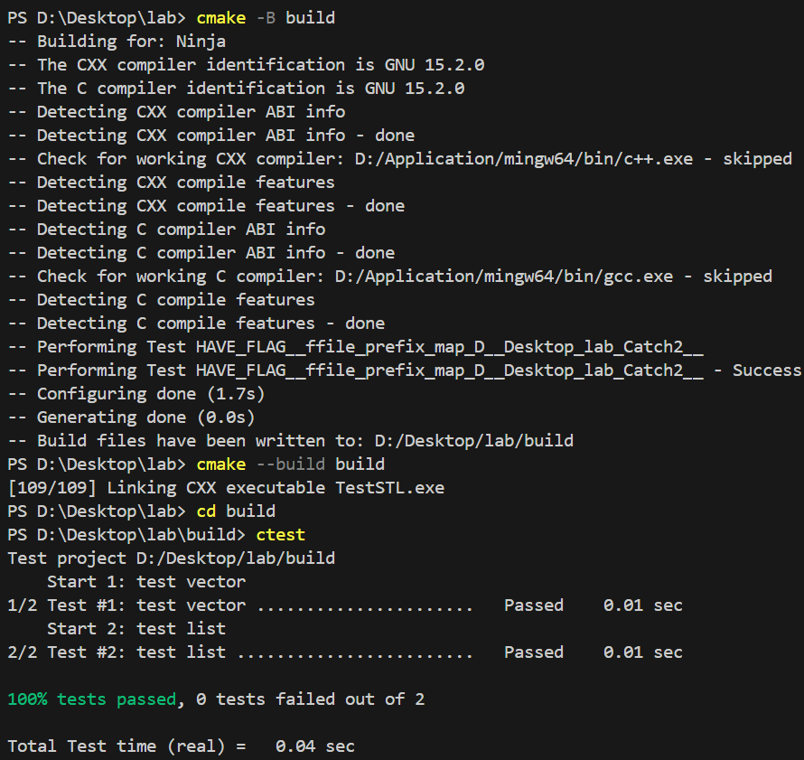

## 实验报告  

#### 实验名称  
实现 Vector 类和 List 类

#### 实验目的  
给出 Vector.hpp, List.hpp 中每一个函数的具体实现，并通过测试。

#### 实验过程  
填补代码，编译并测试。

#### 实验结果  
顺利通过编译和测试，实验成功。  

```
Test project D:/Desktop/lab/build
    Start 1: test vector
1/2 Test #1: test vector ......................   Passed    0.01 sec
    Start 2: test list
2/2 Test #2: test list ........................   Passed    0.01 sec

100% tests passed, 0 tests failed out of 2

Total Test time (real) =   0.04 sec
```

  