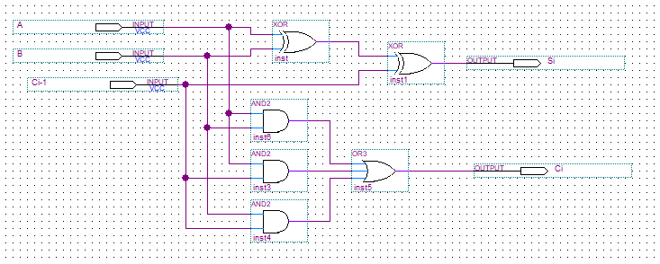
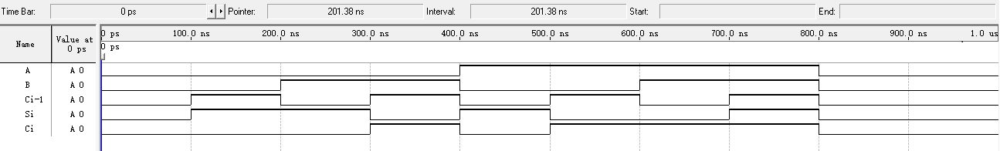

## 实验报告  
#### 实验名称  
QuartusII 操作入门——原理图方式全加器设计
#### 实验目的
熟悉使用 QuartusII 的基本操作方法，利用原理图方式设计 1 位全加器。  
#### 设计与仿真过程
在在 QuartusII 中新建工程，在 bdf 文件中绘制逻辑原理图，放置原件并连接导线，编译并进行波形仿真。  
逻辑原理图如下：
  
#### 实验结果及分析  
仿真得到的波形图如下：  
  
该波形符合全加器逻辑，实验成功完成。