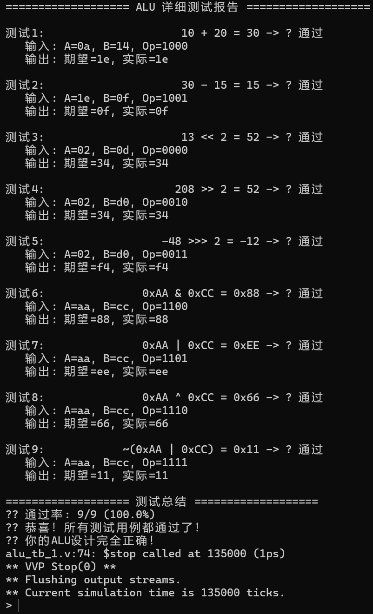
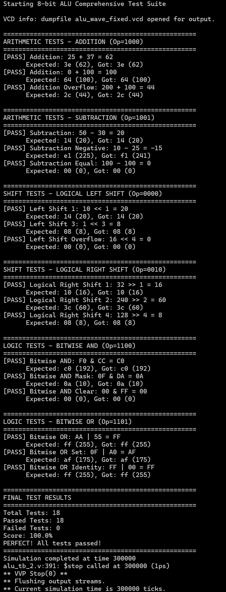

## 实验报告  

#### 实验名称  
用 Verilog 设计实现 8 位 ALU

#### 实验目的
熟悉使用 Verilog 语言的基本语法，设计 8 位 ALU。 

#### 设计与仿真过程
使用 Verilog 编写设计 8 位 ALU，给出仿真结果。
代码如下：
```verilog
module alu(
    input [7:0] A,
    input [7:0] B,
    input [3:0] Op,
    
    output reg [7:0] C
);

always @(*) begin
    case (Op)
        4'b1000: //ADDU
            C = A + B;
        4'b1001: //SUBU
            C = A - B;
        4'b0000: //SLL
            C = B << A[2:0];
        4'b0010: //SRL
            C = B >> A[2:0];
        4'b0011: //SRA
            C = $signed(B) >>> A[2:0];
        4'b1100: //AND
            C = A & B;
        4'b1101: //OR
             C = A | B;
        4'b1110: //XOR
            C = A ^ B;
        4'b1111: //NOR
            C = ~(A | B);
        default:
            C = 8'b00000000;
    endcase    
end

endmodule
```

#### 实验结果及分析  
用 alu_tb_1.v 文件测试结果如下：  
  
用 alu_tb_2.v 文件测试结果如下：  
  
测试均通过，实验成功完成。