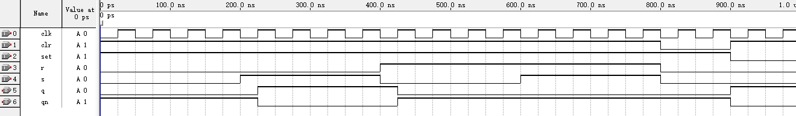
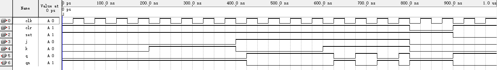

## 实验报告  

#### 实验名称  
利用 Verilog 实现同步 RS 触发器和边沿 JK 触发器  

#### 代码设计  

同步 RS 触发器代码设计如下：
```v
module rs (
    input      clr,   
    input      set,   

    input      clk,    
    input      s,       
    input      r,      

    output reg q,
    output     qn
);

assign qn = ~q;

always @(posedge clk or negedge clr or negedge set) begin

    if (!clr) begin
        q <= 1'b0;
    end 

    else if (!set) begin
        q <= 1'b1;
    end 

    else begin
        if (s && !r) begin
            q <= 1'b1;
        end
        else if (!s && r) begin
            q <= 1'b0;
        end
        else if (s && r) begin //非法输入
            q <= q; 
        end
        else begin
            q <= q;
        end
    end

end

endmodule
```  

边沿 JK 触发器代码设计如下：
```v
module jk (
    input      clr,   
    input      set,   

    input      clk,
    input      j,
    input      k,

    output reg q,
    output     qn
);

assign qn = ~q;

always @(posedge clk or negedge clr or negedge set) begin
    if (!clr) begin
        q <= 1'b0;
    end else if (!set) begin
        q <= 1'b1;
    end else begin
        case ({j, k})
            2'b00: q <= q;       // 保持
            2'b01: q <= 1'b0;    // 复位
            2'b10: q <= 1'b1;    // 置位
            2'b11: q <= ~q;      // 翻转
        endcase
    end
end

endmodule
```

#### 功能分析  

该同步 RS 触发器具有以下功能：  
* 异步清零 当 clr = 0 时，q 立即变为 0  
* 异步置位 当 clr ≠ 0 且 set = 0 时，q 立即变为 1  
* 置位 时钟上升沿，当 s = 1 且 r = 0 时，q 变为 1  
* 复位 时钟上升沿，当 s = 0 且 r = 1 时，q 变为 0 
* 保持 时钟上升沿，当 s = 0 且 r = 0 时，q 保持不变 
* 非法输入，采取保持策略  

  
该边沿 JK 触发器具有以下功能：
* 异步清零 当 clr = 0 时，q 立即变为 0
* 异步置位 当 clr ≠ 0 且 set = 0 时，q 立即变为 1
* 置位 时钟上升沿，当 j = 1 且 k = 0 时，q 变为 1
* 复位 时钟上升沿，当 j = 0 且 k = 1 时，q 变为 0
* 保持 时钟上升沿，当 j = 0 且 k = 0 时，q 保持不变
* 翻转 时钟上升沿，当 j = 1 且 k = 1 时，q 取反

#### 模拟仿真  

同步 RS 触发器模拟结果如下：  

  

边沿 JK 触发器模拟结果如下：  

  

#### 实验结论  

模拟了全部功能，波形符合预期，实现无误，实验成功。