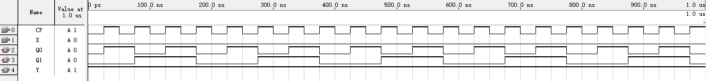
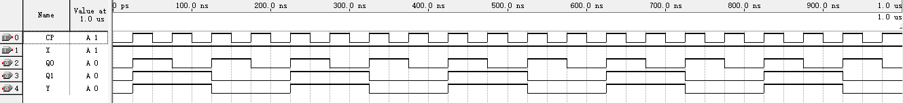

## 实验报告  

#### 实验名称  
时序电路分析  

#### 电路分析  

同步时序电路   

输出方程：  

$$ Y = \overline{X\overline{Q_1^n} } = \overline{X} + Q_1^n $$  

驱动方程：  

$$ \begin{cases}
    T_1 = X \oplus Q_0^n 
    \\
    T_0 = 1
\end{cases} $$  

T 触发器的特性方程为 $Q^{n+1} = T \oplus Q^n $  

状态方程：  

$$ \begin{cases}
    Q_1^{n+1}  = Q_1^n \oplus (X \oplus Q_0^n)  
    \\ 
    Q_0^{n+1} = \overline{Q_0^n}
\end{cases} $$

状态表:  

| 输入 | 现态         | 次态                 | 输出 |
| ---- | ------------ | -------------------- | ---- |
| $X$  | $Q_1^nQ_0^n$ | $Q_1^{n+1}Q_0^{n+1}$ | $Y$  |
| $0$  | $00$         | $01$                 | $1$  |
| $0$  | $01$         | $10$                 | $1$  |
| $0$  | $10$         | $11$                 | $1$  |
| $0$  | $11$         | $00$                 | $1$  |
| $1$  | $00$         | $11$                 | $0$  |
| $1$  | $01$         | $00$                 | $0$  |
| $1$  | $10$         | $01$                 | $1$  |
| $1$  | $11$         | $10$                 | $1$  |


#### 功能分析  

当 $X = 0$ 时，四个状态递增循环，$00\rightarrow 01 \rightarrow 10 \rightarrow 11 \rightarrow 00 \rightarrow \cdots$

当 $X = 1$ 时，四个状态递减循环，$00\rightarrow 11 \rightarrow 10 \rightarrow 01 \rightarrow 00 \rightarrow \cdots$  

该电路是一个 2 位二进制同步可逆计数器。


#### 代码设计  
```v
module sequential (
    input  CP,
    input  X,
    output Y,
    output reg Q0,
    output reg Q1
);

always @(posedge CP) begin
    Q0 <= ~Q0;
    Q1 <= Q1 ^ (X ^ Q0);
end

assign Y = ~X | Q1;

endmodule
```  

#### 模拟仿真  

$X=0$ 时，模拟结果如下：  

  

$X=1$ 时，模拟结果如下：  

  

#### 实验结论  

波形符合预期，实验成功。