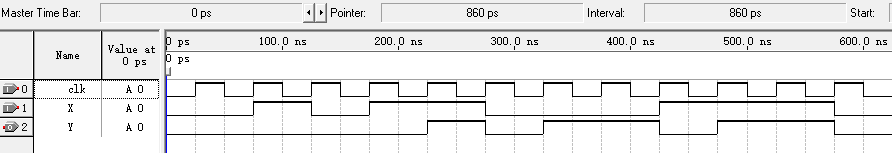

## 实验报告  

#### 实验名称  
设计序列检测器  

#### 实验目的  

设计一个输入为 X，输出为 Y 的串行输入序列检测器，当输入序列最近两个输入为 00 或 11 时，输出 Y = 1，否则 Y = 0 。例如，输入 010110001110  输出为 000010110110 。  

#### 设计思路  

使用寄存器缓存前一个输入，在每个时钟上升沿，将当前输入 X 存入寄存器 x_prev，当前输出 Y = (X == x_prev) ? 1 : 0 。第一个时钟周期没有前一个输入，在第一个时钟周期输出为 0 。  

#### 代码设计  

```v
module seq_detector (
    input  wire clk,
    input  wire X,
    output reg  Y
);

    reg x_prev;           
    reg first_cycle = 1'b1;      

    always @(posedge clk) begin
        x_prev <= X;
        if (first_cycle) begin
            Y <= 1'b0;
            first_cycle <= 1'b0;
        end else begin
            Y <= (X == x_prev) ? 1'b1 : 1'b0;
        end
    end

endmodule
```

#### 仿真结果

  

#### 实验结论  

仿真波形符合预期，实验成功。