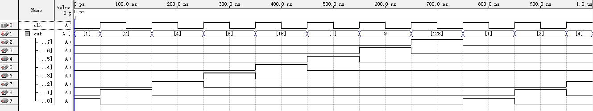

## 实验报告  

#### 实验名称  
顺序脉冲发生器设计  

#### 实验目的  

设计一个循环产生8个脉冲的顺序脉冲发生器，输入为时钟脉冲 clk ，输出为8个顺序脉冲。  

#### 设计思路  

在每个时钟上升沿，将 out 循环左移一位。  
 
#### 代码设计  

```v
module seq_pulse (
    input      clk,
    output reg [7:0] out
);

initial begin
    out = 8'b0000_0001;
end

always @(posedge clk) begin
    out <= {out[6:0], out[7]};
end

endmodule
```

#### 仿真结果

  

#### 实验结论  

仿真波形符合预期，实验成功。