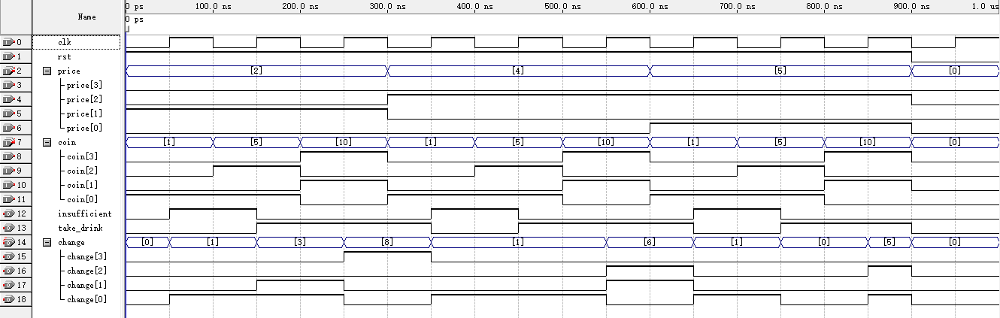

## 实验报告  

#### 实验名称  
简易自动售货机的控制逻辑电路设计  

#### 输入输出  

##### 输入信号  

* clk ：时钟信号  
* rst ：低电平有效的复位信号  
* coin[3:0] ：投币面值信号，约定如下：
    * 'b0001 ：投入 1 元
    * 'b0101 ：投入 5 元
    * 'b1010 ：投入 10 元
    * 'b0000 ：无投币
* price[3:0] ：饮料价格信号，约定如下：  
    * 'b0010 ：价格 2 元
    * 'b0100 ：价格 4 元
    * 'b0101 ：价格 5 元  

##### 输出信号  

* insufficient ：金额不足
* take_drink ：可取饮料
* change[3:0] ：退还/找零金额

#### 设计思路  

* 用户先选择饮料价格，然后投入硬币，并触发逻辑判断，进行交易。  
    * 若金额 < 价格 → 输出 insufficient = 1，change = 金额。
    * 若金额 == 价格 → 输出 take_drink = 1。
    * 若金额 > 价格 → 输出 take_drink = 1，change = 累计金额 - 饮料价格。
* 为简化模型，本系统每次交易仅处理一次投币。  
* 交易完毕后复位，等待下一次交易。

#### 代码设计  

```v
module vending_machine (
    input             clk,
    input             rst,     
    input      [3:0]  coin,     
    input      [3:0]  price,         

    output reg        insufficient,
    output reg        take_drink,
    output reg [3:0]  change
);

always @(posedge clk or negedge rst) begin
    if (!rst) begin
        insufficient   <= 1'b0;
        take_drink     <= 1'b0;
        change  <= 4'd0;
    end else begin
        insufficient   <= 1'b0;
        take_drink     <= 1'b0;
        change  <= 4'd0;

        if (coin != 4'd0) begin
            if (coin < price) begin
                insufficient  <= 1'b1;
                change <= coin;
            end else if (coin == price) begin
                take_drink <= 1'b1;
            end else begin
                take_drink    <= 1'b1;
                change <= coin - price;
            end
        end
    end
end

endmodule
```

#### 仿真结果

  

#### 实验结论  

仿真波形符合预期，实验成功。