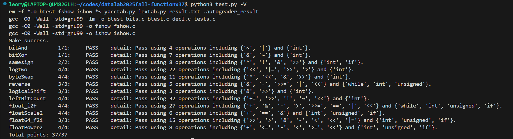

# datalab 报告

姓名：

学号：

| 总分 |bitAnd | bitXor|samesign | logtwo | byteSwap | reverse |
|-|-|-|-|-|-|-|
|  37 | 1 |1| 2| 4 | 4 |3 |  

| logicalShift |leftBitCount | float_i2f|floatScale2  |float64_f2i|floatPower2|
|-|-|-|-|-|-|
|3 |4 |4 |4 |3 |4 |

test 截图：


<!-- TODO: 用一个通过的截图，本地图片，放到 imgs 文件夹下，不要用这个 github，pandoc 解析可能有问题 -->

## 解题报告

### 亮点

<!-- 告诉助教哪些函数是你实现得最优秀的，比如你可以排序。不需要展开，展开请放到后文中。 -->

1. logtwo
2. float_i2f

### logtwo

```c
int logtwo(int v) {
    // 即求最高位1的位置
    int temp = ((v >> 16) > 0) << 4;  // 前半部分判断高16位是否有1
    int rst = temp;                   // 若有 rst += 16
    v = v >> temp;                    // 若有扔去v后16位，将前16位移到后16位

    temp = ((v >> 8) > 0) << 3;  // 以下同理
    rst |= temp;                 // |= 相当于 +=
    v = v >> temp;

    ......// 后续同理部分省略

    return rst;
}
```

主要采用二分的思路，统计最高位 1 在的位置 .   
(v >> 16) > 0 若高 16 位有 1，则返回 1；若最高 16 位没有 1，则返回 0 .   
然后 rst += 16 或 0 .    
用 temp >> 4 统一了 16 或 0 .   
然后若最高位 1 在高 16 位，将其右移 16 位，使最高位在 低 16 位，便于后续统一处理 .  
采用二分使得每次加法处理的是不同位的二进制值，用 |= 代替 += .

### float_i2f
```c
unsigned float_i2f(int x) {
    if (x) {
        // 处理不是 0 的情况
    }
    return 0;  // hack x == 0
}
```
float 的 0 是特殊值，直接返回，这样少一个 op (!) .
```c
        unsigned rst = x & 0x80000000;  // 符号位部分
        if (rst) {
            x = -x;  // 获得绝对值
        }
```
提取以下符号位放到结果里，并将 x 取绝对值 .
```c
        int exp = 0;
        unsigned temp = x;  // hack x == 0x80000000 ，所以要用unsigned
        while (temp >>= 1) {
            ++exp;
        }
        rst = rst + ((exp + 127) << 23);       // 指数部分
```
如果此处用 int ，由于前面取的是相反数，0x80000000 仍然会溢出成复数然后算术右移使得循环无法结束，改成 unsigned 使用逻辑右移 .
加上偏置量 127 并移到正确位置 .
```c
        unsigned frac = x & ((1 << exp) - 1);  // 隐藏首1
        int k = exp - 23;
        if (k > 0) {                          
            // 处理舍入规则
        } else {
            frac = frac << (-k);  // 补足23位
        }
        rst = rst + frac;
        return rst;
```
获取尾数部分，先隐藏掉首 1，然后判断位数与 23 的关系，如果不足直接补足即可
``` c
            int half = 1 << (k - 1);          // 中间点
            int dst = frac & ((1 << k) - 1);  // 舍弃位
            frac >>= k;
            int last = frac & 1;
            if ((dst > half) | ((dst == half) & last)) {  // 超过一半或者末位为奇数
                ++frac;                                   // 进位
            }
```
超过 23 位的使用舍入规则 round-to-even：
如果舍弃部分小于一半就直接舍弃，大于一半就进位，如果恰好相等考虑保留的最后一位：
如果为 1 则进位，否则舍弃 .  

返回最终结果 . 

整体就是一个大模拟 .  

## 反馈/收获/感悟/总结

<!-- 这一节，你可以简单描述你在这个 lab 上花费的时间/你认为的难度/你认为不合理的地方/你认为有趣的地方 -->

<!-- 或者是收获/感悟/总结 -->

<!-- 200 字以内，可以不写 -->
1. 二进制真是太神奇啦！
2. 花了差不多两天，感觉max_op有的需要多一点，有的可以不用那么多（
3. 好玩
## 参考的重要资料
主要参考了 AI 提供的 int 的补码表示和 float 的 IEEE754 的具体规则
<!-- 有哪些文章/论文/PPT/课本对你的实现有重要启发或者帮助，或者是你直接引用了某个方法 -->

<!-- 请附上文章标题和可访问的网页路径 -->
