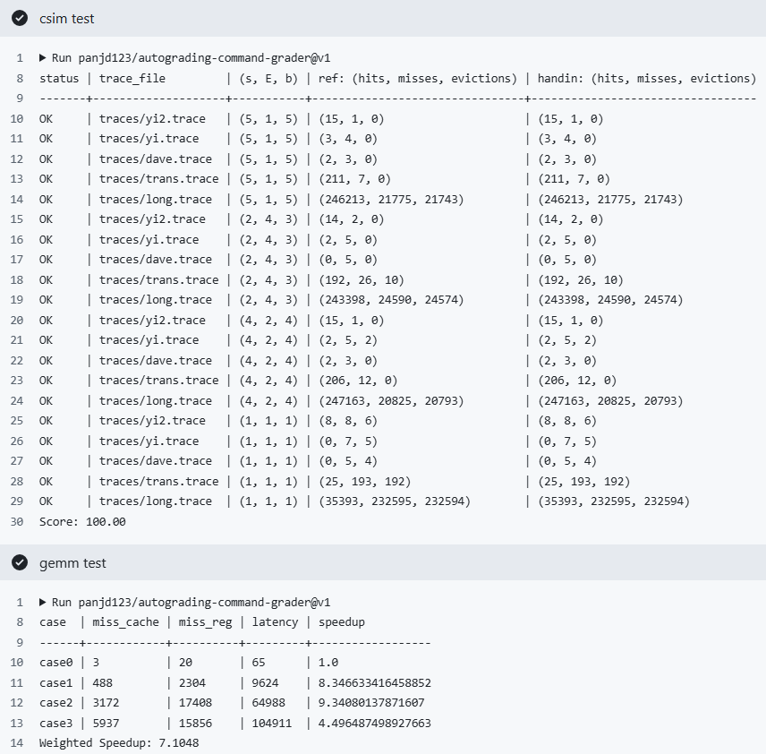

# CacheLab 报告

| csim 分数 | case1 speedup | case2 speedup | case3 speedup | weighted speedup |
| --------- | ------------- | ------------- | ------------- | ---------------- |
| 100.00    | 8.35          | 9.34          | 4.50          | 7.10             |

<!-- 保留两位小数，四舍五入 -->

Autograder 截图：



<!-- 请同时将 Github Action 中的 csim test 和 gemm test 展开截图，并保证左上角出现你的仓库名，你可能需要调整浏览器缩放 -->

<!-- 如果 Github Action 不可用，本地的两个 test 的运行截图也可以-->

## Part A: cache 模拟器

### 实现简述

<!-- 简述 LRU 替换策略的 cache 的具体实现细节 -->
* 首先使用 ```getopt``` 函数读入命令行参数
* 用结构体 ```set``` 模拟缓存组，共 $2^s$ 个缓存组
* 用结构体 ```line``` 模拟组中的行，缓存组最多可写入 $E$ 个行
* 每个组中使用双向链表存储行，每对一个行进行访问/存储操作，就将该行移至链表头，这样尾部的节点就是最先被替换的节点。时间复杂度为 $O(1)$
* 用哈希表查找对应行是否在缓存中。时间复杂度为 $O(1)$
* 若命中，```hits++```，移动到链表头。若为存储操作，标记 ```dirty == 1```
* 若未命中，```misses++```。检查组是否已满：
    * 若未满，加入新行写入数据并移动到链表头
    * 若已满，将链表尾节点作为被替换的行，```evictions++```，更新数据并移动到链表头

### 亮点

<!-- 如果你有模拟性能上的优化，或者别的什么亮点可以用额外的篇幅具体讲讲，否则留空就可。 值得一提，这作为了第36次CSP考试的大模拟原题。 -->
* 使用双向链表 + 哈希表，使得操作的时间复杂度为 $O(1)$ 。这样应该可以解决在第 36 次 CSP 考试中出现的 TLE 问题

## Part B: 矩阵乘法优化

<!-- 下文请统一用 "行 * 列" 来表述矩阵形状 -->

<!-- 如果你想用 x, y 或者 i, j 变量来辅助你的表述，
请保证他们的对应关系是 x,y <=> i,j <=> 行,列，不然助教会晕，你们的分数也可能跟着晕，
我指你想说某个单独的矩阵中的 x 行 y 列的时候，不要说 y 行 x 列，
当然有三个矩阵的时候就没这回事了
 -->

### 亮点

<!-- 这相当于摘要，用最精简且可以被理解的关键词 + 简短的句子，分点描述你所有使用到的优化技巧，如果他们的重要性不同，请按顺序讲 -->

<!-- 比如：1. 分块：xxxx -->

1. 矩阵分块  
2. j 偏移

<!-- 由于你还需要在后文详细说明，因此不必在此大费周章 -->

#### 我认为的最优秀的实现排序

<!-- 请排序这三个 case，把你认为的最优秀的实现排在前面 -->

1. case1
2. case2
3. case3

（实现的都不咋样）

### case1

<!-- 1. 展示你的 cache miss 和 register miss -->
| case  | miss_cache | miss_reg | latency | speedup           |
| ----- | ---------- | -------- | ------- | ----------------- |
| case1 | 488        | 2304     | 9624    | 8.346633416458852 |


<!-- 2. 分析你的算法的理论 miss，如果和实际不完全相符，误差可能来自于哪里
（通常你的分析不用完全准确，不影响后续你展示算法，或者不同算法性能的大小关系即可） -->

<!-- 3. 你是怎么想到你的方法的，2 和 3 点可以调换顺序或者合并。或者说你的方法有哪些巧妙的设计。 -->
#### 算法分析
###### 进行了简单的 4*4 分块优化：
```
for (i += 4)
    for (j += 4)
        for (k)
```
使得 A 的一行在 k 循环中被完整复用，而 C 只有写入

###### 进行了 j 偏移：
```
j = (jj + i + 8) % 16
```
A 和 B 在内存中相距 1024B = 64 cache 行 = 2 × cache 容量，这导致 A[x] 和 B[x] 映射到同一 cache 组  
通过 + 8 把 B 的访问整体平移了，避免和 A 同组

#### 理论分析

* 每个块内，A 按行读取，需读取 4 次；B按列读取，需读取 16次；C 按行写入，需写入 4 次  
* 总计 16 * (4 + 16 + 4) = 384 次
* j 偏移无法完全解决 A 和 B 冲突的问题，大约会有四分之一的冲突，384 * 1.25 = 480 ≈ 488

<!-- 4. 我们预计准确分析理论 miss，甚至是大致分析都可能是相当费力的，
此时我们更偏向你挑选一个你最想分享的 case 认真分析，其他 case 可以草率一点。
但这不代表我们只看一个 miss 分析，而是在你精力有限时请把最精华的写出来。
不要费了功夫写了三个分析但每个都浅尝辄止。
我们认为的排序是：
三个都精细分析 > 精细分析一个，潦草分析两个 > 只精细分析一个 > 潦草分析三个
 -->

<!-- 5. 分析 naive 算法的 cache miss 原因，视总篇幅也可以不讲 -->

<!-- 不要贴大段的代码，如果需要贴代码，请一小节一小节，并配合文字解释 -->

<!-- 你可以贴伪代码，或者用注释替代不重要的部分，尽量让报告精简 -->

<!-- 虽然我们分成了 3 节分别对应每个 case，但你不用每次都重复描述共通的思路，你可以修改报告的形式 -->

<!-- 原则上，简单的方法一个 case 所需描述的字数不应超过 500 字，复杂的不应超过 1000 字 -->

<!-- 如果你没有什么优化思路，这一节也可以就讲 baseline 算法的 cache miss 的分析 -->

<!-- 如果你的优化思路特别多，请先分点简述一下，如果超出了我们的字数限制，请把最重要的部分在规定字数内先解释清楚，再用”明显的分割线“隔开，再接着写次重要的优化 -->

<!-- 尽量给出你每个优化，或者是渐进的优化中每一步对性能的提升分别是多少 -->


<!-- 如果你有除了 gemm_test.py 脚本算出来的 cache miss 和 register miss 的其他数据展示，比如你跑了个参数的网格搜索，
请保证这些数据是可复现的，给出复现的代码，和复现代码的执行方法文档。这些应该包含在提交仓库中
-->

### case2
| case  | miss_cache | miss_reg | latency | speedup          |
| ----- | ---------- | -------- | ------- | ---------------- |
| case2 | 3172       | 17408    | 64988   | 9.34080137871607 |

* 此部分采用了与 case1 完全相同的优化，不再赘述

### case3
| case  | miss_cache | miss_reg | latency | speedup           |
| ----- | ---------- | -------- | ------- | ----------------- |
| case3 | 5937       | 15856    | 104911  | 4.496487498927663 |

#### 算法分析

##### 边界融合  

剩余 4 列的边界放入同一个 i 循环的 block 中，使得 A 的访问得到复用

##### 矩阵分块

这里使用的是 4 * 5 分块，与之前不同。这个分块方式是多次尝试出来的

#### 理论分析  

* 由于矩阵大小不整齐，存在大量难以分析的跨行访问
* 对于 A ，29 * 35 / 4 ≈ 254
* 对于 B ，29 * 35 = 1015
* 对于 C ，29 * 29 / 4 ≈ 210
* 总计大约 4 * (254 + 1015 + 210) ≈ 6000
* 这个估计非常粗糙

## 反馈/收获/感悟/总结

<!-- 这一节，你可以简单描述你在这个 lab 上花费的时间/你认为的难度/你认为不合理的地方/你认为有趣的地方 -->

<!-- 或者是收获/感悟/总结 -->

<!-- 我们会认真听取大家的建议～ -->

1. 花费一周，难
2. 感觉 buffer 太小了，想到的优化思路无法实现
3. 希望结束以后可以公布一下最优的优化思路
4. 深入理解了 cache 的特性

## 参考的重要资料

<!-- 有哪些文章/论文/PPT/课本对你的实现有重要启发或者帮助，或者是你直接引用了某个方法 -->

<!-- 请附上文章标题或概述和可访问的网页路径 -->

<!-- 不列出参考了的参考资料会被认为是学术不端 -->
主要参考了 Claude 提出的优化思路